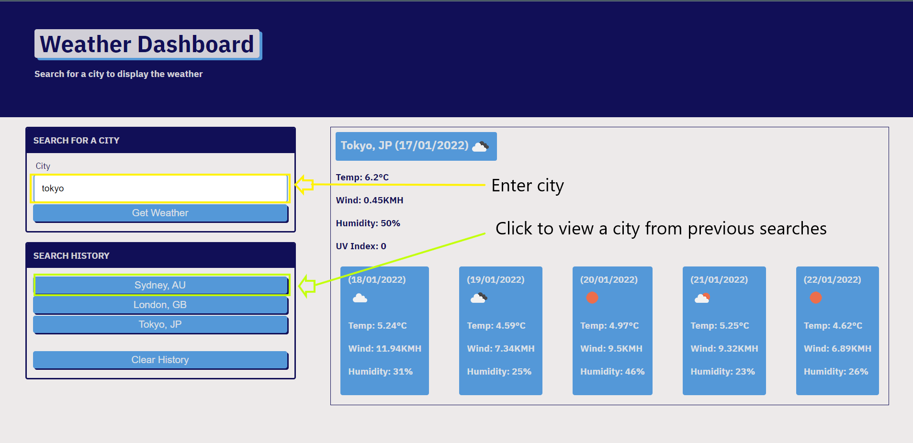

# 06-weather-dashboard

## Why build this project?

In week 06 of the Coding Bootcamp at University of Sydney, I've been learning about working with server-side APIs. This project works with public APIs to display data on a web page in the form of a dashboard. 
The weather forecast is useful information for any user, which makes it a great app to start with when working with server-side APIs.

## Usage

Enter a query in the text input box i.e Sydney, Australia.

Click on the button in Search history to query a previously searched city and/or country

## Features

- Uses a public weather API to get weather data in JSON format
- Displays basic weather data which includes current data and 5-day forecast
- Vanilla Javascript (pre-ES6)
- Mobile CSS Design
- Seach history function
- Momentjs

## Demo

